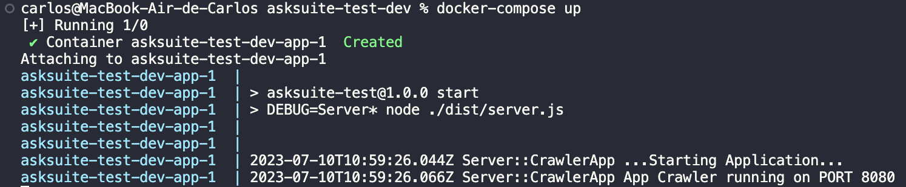
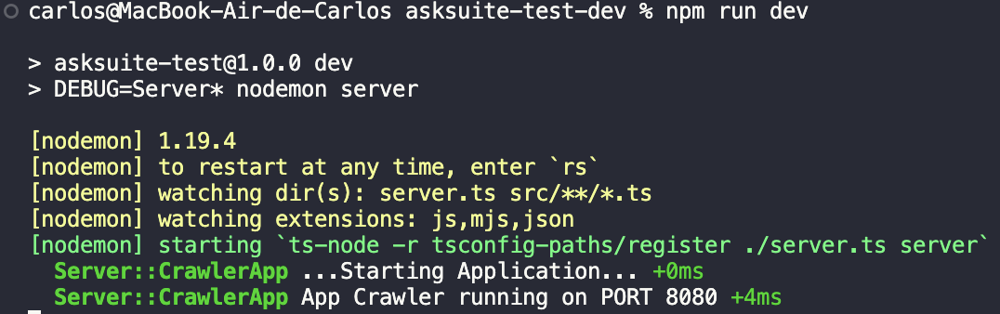
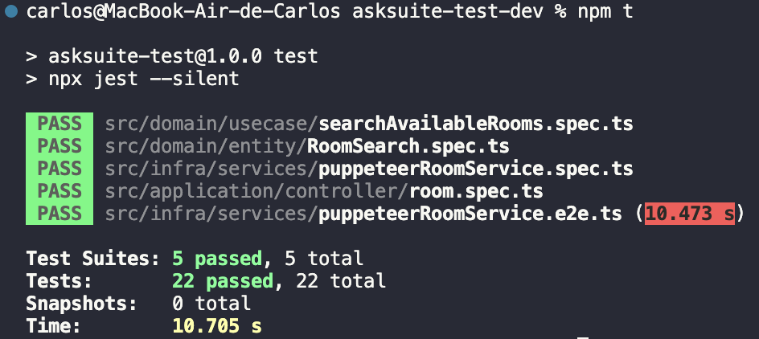
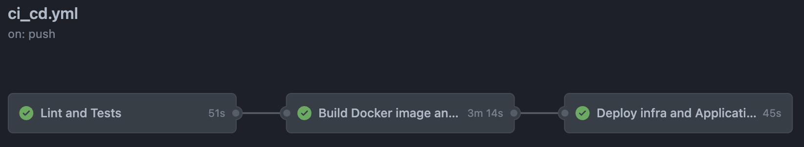

# Hotel Crawler
This is a simple bot project that uses Puppeteer to retrieve data from a site

## Technologies and Libraries
* **Node v16**: Runtime environment
* **Typescript**: Programming Language
* **Express**: Path router
* **Puppeteer**: Controls Chrome/Chromium for crawler
* **Jest**: Runtime Tester for Unit and Integration tests
* **Eslint**: Linter for code quality
* **dotenv**: For env configuration
* **debug** and **winston**: for logging
* **Zod**: Schema validation
* **Clean Arch**: Code design
* **Docker**: For image building
* **Terraform**: For IaC
* **AWS**: As cloud provider
* **Github workflows**: For CI/CD

## Deployed Test
You can test deployed API in this link


## Endpoints:
### /search
* Make a Search trough the endpoint "/search"
    * The expected payload is:
    
        <pre>
        {
            "checkIn": "YYYY-MM-DD", // Check-in date
            "checkOut": "YYYY-MM-DD", // Check-out date
            "numberOfAdults": 2, // optional - default 2
            "numberOfChildren": 1 // optional - default 0
        }
        </pre>
        
       Example
       
        <pre>
        {
            "checkIn": "2021-07-01", 
            "checkOut": "2021-07-03"
        }
        </pre>
        
    * The expected result is an array of rooms:
    
        <pre>
        [{
            "name": string, // Room name
            "description": string,  // Room description
            "price": string, // Room daily price
            "image": string, // Room main photo
        }]
        </pre>
        
        Example
        
        <pre>
        [{
            "name": "STUDIO CASAL",
            "description": "Apartamentos localizados no prédio principal do Resort, próximos a recepção e a área de convivência, com vista para área de estacionamento não possuem constanda. Acomoda até 1 adulto e 1 criança ou 2 adultos", 
            "price": "R$ 1.092,00",
            "image": "https://letsimage.s3.amazonaws.com/letsbook/193/quartos/30/fotoprincipal.jpg"
        },
        {
            "name": "CABANA",
            "description": "Apartamentos espalhados pelos jardins do Resort, com vista jardim possuem constanda. Acomoda até 4 adultos ou 3 adultos e 1 criança ou 2 adultos e 2 criança ou 1 adulto e 3 crianças, em duas camas casal.", 
            "price": "R$ 1.321,00",
            "image": "https://letsimage.s3.amazonaws.com/letsbook/193/quartos/32/fotoprincipal.jpg"
        }]
        </pre>
### /health
* Path used to check application health. It makes a rooms available search and analyzes the response to see if it is as expected. Returns 200 when it is all ok, 500 when something is wrong.

## Running locally
### Docker Compose
To run, you just need to have Docker and docker-compose installed, and execute the following command at the root of the project:

```docker-compose up```


### node run dev
Running with node:

```npm i```

Then

```npm run dev```



### Run tests

Unit tests -> ```npm run test:unit```

All tests ->    ```npm t```



**npm t** runs a integration test that invokes Puppeteer

## Code Design
Code was designed thinking on the Clean Arch way, with the following layers:

### Domain
In this layer we have the Entities which handles most of the business logic and the usecases which orchestrates entities and services (repositories). Also there is defined interfaces for the services being used by the usecases
### Infra
Layer used to provide implementation to the services interfaces defined at Domain layer (in this case the implementation of the Puppeteer service)
### Application
In this layer contains routers that uses controller and controllers that interact with usecases. Also for facilitating there are some factories for routers and controllers.
### shared
This layer is a cross layer that can have code accessed by all other layers

## CI/CD
For CI/CD it was used two main techs: Terraform and Github flows.
### How it works
We have 3 main jobs on the pipeline:



1. **Lint and Tests**
    * Runs a linter check and then all Unit tests
2. **Docker image build and push to Repository**
    * Build the Docker image and then publish it to ECR repository
3. **AWS App Deploy**
    * Creates all needed infra resources like ALB, ECS cluster, service... and mainly the ECS Task definition using the published Docker image from previous step
### Terraform
All needed infraestructure resources needed by the application was created with Terraform. You can find terraform code on the folder `/terraform`.

You can try it with terraform comands **init** and **apply** (needs AWS CLI with valid credentials).
